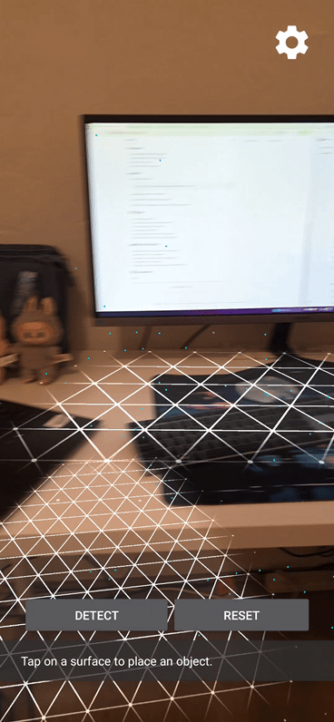

# Augmented Reality Smart Vision

## 🌟 Overview

AR Smart Vision is an advanced Android application that combines the power of Google's ARCore with computer vision capabilities. It allows users to interact with augmented reality objects, detect real-world surfaces, and identify objects in their environment through their device's camera.

## ✨ Features

- **Real-time AR Object Placement**: Place and interact with virtual objects in your real environment
- **Surface Detection**: Automatically detect and track real-world surfaces
- **Object Recognition**: Identify objects in your environment
- **Environmental Understanding**: Advanced lighting and environmental mapping
- **Interactive Anchors**: Place and manage multiple AR anchors in your space
- **Smooth Performance**: Optimized rendering and tracking for smooth AR experience

## 🚀 Getting Started

### Prerequisites

- Android device with ARCore support
- Android Studio Arctic Fox or newer
- Kotlin 1.8.0 or newer
- ARCore SDK 1.40.0 or newer

### Installation

1. Clone the repository:
   ```bash
   git clone https://github.com/yourusername/AR-Smart-Vision.git
   ```

2. Open the project in Android Studio

3. Sync Gradle files and install dependencies

4. Build and run the application on your ARCore-supported device

## 🎯 Usage

1. Launch the application
2. Grant camera permissions when prompted
3. Point your camera at a flat surface
4. Tap to place virtual objects
5. Use the scan button to identify objects in view
6. Interact with placed objects using touch gestures

## � Technical Details

- Built with Kotlin for modern Android development
- Utilizes ARCore for AR capabilities
- Implements Cloud Vision API for object detection
- Uses OpenGL ES for rendering
- Implements environmental lighting for realistic AR objects

## 📱 Demo



---

<div align="center">
  Made with ❤️ by Mimo
</div>
